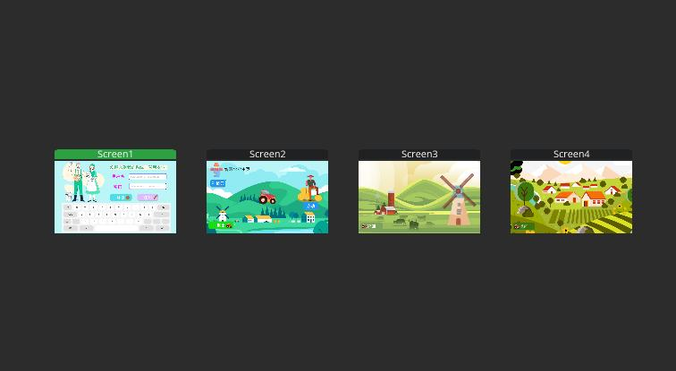
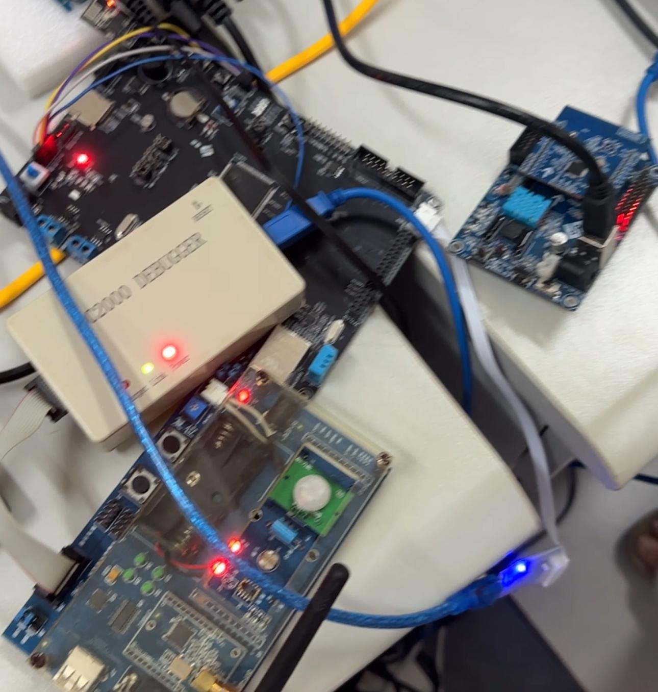

# smart_agri_environmental_monitoring_system
WiFi + ZigBee + MQTT Multi‑Protocol IoT Transmission Practice

---

## Project Overview
This project is a comprehensive practice of the IoT transmission layer, designed for smart agriculture scenarios. It builds a multi‑protocol environmental monitoring system integrating **ZigBee, WiFi, and MQTT**, realizing the full‑process functions of sensor data collection, wireless transmission, cloud upload, and local visualization display.

The system uses the **GEC6818 development board** as the main control terminal, **ESP8266** as the WiFi gateway, and **ZigBee CC2530** modules for sensor networking. It collects temperature, humidity, and light data in greenhouses, transmits data to the cloud via MQTT, and displays it in real time on the LVGL graphical interface, achieving closed‑loop monitoring and control.

Submitted for: **Comprehensive Practice of IoT Transmission Layer**

---

## ✨Demo Results
### LVGL Graphical Interface

### Hardware & Networking

### Real‑Time Data Log

---

## Key Features
- Multi‑protocol integration: ZigBee + WiFi + MQTT
- Real‑time monitoring: temperature, humidity, light intensity
- ZigBee self‑organizing network, low‑power and multi‑node coverage
- MQTT lightweight cloud transmission, stable and reliable
- LVGL graphical interface: login, navigation, data display, device control
- Multi‑thread data processing, non‑blocking UI update
- Agricultural environment closed‑loop control

---

## System Architecture
ZigBee End Nodes (Sensors)
↓ (ZigBee wireless network)
ZigBee Coordinator
↓ (UART serial communication)
ESP8266 WiFi Gateway
↓ (WiFi + MQTT)
Cloud MQTT Server
↓
GEC6818 Development Board (LVGL UI)

---

## Hardware Components
- Main Controller: GEC6818 Embedded Board
- WiFi Gateway: ESP8266
- ZigBee Module: CC2530
- Sensors: DHT11 (temp/humidity), ADC Light Sensor

---

## Development Environment
- Host System: Windows 10 + WSL (Ubuntu 22.04)
- Compiler: GCC / Make
- Graphics Library: LVGL 9.1.0 + SDL2
- Cloud Server: Alibaba Cloud ECS (Mosquitto MQTT)
- UI Design: SquareLine Studio 1.4.2

---

## Project Structure
'''text
smart_agri_environment_monitoring_system/
├── README.md                  # This file
├── asset/                     # Demo images
│   ├── hardware_setup.jpg
│   ├── lvgl_ui.jpg
│   └── console_data_log.jpg
├── env_build/                 # Environment setup scripts
│   ├── wsl_env.sh
│   ├── mosquitto_install.sh
│   └── esp8266_at_config.txt
└── src/
    ├── lvgl_ui/               # LVGL UI code (SquareLine Studio output)
    ├── mqtt_wifi/             # WiFi + MQTT module
    ├── serial_parse/          # Serial data parser
    └── zigbee_collect/        # ZigBee collection and reporting
'''

---

## Conclusion
This practice successfully implements a multi‑protocol IoT environmental monitoring system for smart agriculture. It fully verifies the feasibility of ZigBee, WiFi, and MQTT integration, effectively solving the problems of scattered sensor nodes and unstable remote communication. The system achieves stable data collection, remote transmission, and local visualization, with good practical and promotional value for smart agricultural applications.

---

## License
For educational and course practice purposes only.
    
